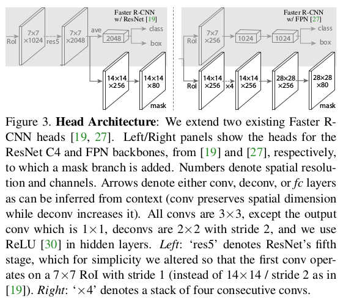

本篇接train篇，来介绍模型以及相关部分。

重点是介绍如何利用config去完成模型的构造，同时探究detectron2如何去实现一个网络。**由于博主比较熟悉r-cnn系列的网络，所以这篇博客一开始将会以faster-rcnn为主进行介绍，后续会继续更新其他网络的实现细节**

在这里提供detectron2 model文件的目录，有兴趣的同学根据需要只查看你想了解的目录即可

[meta_arch](#meta_arch)

[rpn](#rpn_网络)

[roi_head](#ROI_heads)

[fastrcnn总结](#fastrcnn_总结)

### meta_arch

对应网络讲解

[meta_arch:rcnn](#rcnn)


#### rcnn

在rcnn文件中提供了两个实现的网络，一个是rcnn网络，faster-rcnn,mask-rcnn都是配置文件加上这个网络一起实现的。还有一个是proposal网络，用于生成proposal，用于训练，可视化，评估等等。**当然需要注意的是rcnn网络中已经包含了生成proposal的部分，单独实现一个proposal网络应该是为了实验的方便**

那么我们重点放在rcnn网络，我们先来看看他的源代码：
```python
@META_ARCH_REGISTRY.register()
class GeneralizedRCNN(nn.Module):
 

    def __init__(self, cfg):
        super().__init__()

        self.device = torch.device(cfg.MODEL.DEVICE)
        self.backbone = build_backbone(cfg)
        self.proposal_generator = build_proposal_generator(cfg, self.backbone.output_shape())
        self.roi_heads = build_roi_heads(cfg, self.backbone.output_shape())
        self.vis_period = cfg.VIS_PERIOD
        self.input_format = cfg.INPUT.FORMAT

        assert len(cfg.MODEL.PIXEL_MEAN) == len(cfg.MODEL.PIXEL_STD)
        num_channels = len(cfg.MODEL.PIXEL_MEAN)
        pixel_mean = torch.Tensor(cfg.MODEL.PIXEL_MEAN).to(self.device).view(num_channels, 1, 1)
        pixel_std = torch.Tensor(cfg.MODEL.PIXEL_STD).to(self.device).view(num_channels, 1, 1)
        self.normalizer = lambda x: (x - pixel_mean) / pixel_std
        self.to(self.device)


```
 首先这个类会进行注册，这样当我们在配置文件中写道用什么网络时，可以根据注册机制直接get(name)来获取这个网络
 
 然后我们来看看该类的__init__方法，可以看到这里定义了rcnn的几个重要大块：backbone,rpn,roi。
 而mask-rcnn与faster-rcnn的主要区别也就是roi的改变而已，所以我们可以根据配置文件确定这几个大块的实现从而构建出不同的rcnn网络。
 
 当然除此之外，这里还定义了可视化以及图像正则化的一些参数。
 
 ```python
 
    def forward():
        if not self.training:
            return self.inference(batched_inputs)
        
		
		#返回的是Imagelist
        images = self.preprocess_image(batched_inputs)
        if "instances" in batched_inputs[0]:
            gt_instances = [x["instances"].to(self.device) for x in batched_inputs]
        elif "targets" in batched_inputs[0]:
            log_first_n(
                logging.WARN, "'targets' in the model inputs is now renamed to 'instances'!", n=10
            )
            gt_instances = [x["targets"].to(self.device) for x in batched_inputs]
        else:
            gt_instances = None
        
		#返回的是dict，features['p2']=p2
        features = self.backbone(images.tensor)

        if self.proposal_generator:
		    #返回的是List（instance)的proposals，losses是dict
            proposals, proposal_losses = self.proposal_generator(images, features, gt_instances)
        else:
            assert "proposals" in batched_inputs[0]
            proposals = [x["proposals"].to(self.device) for x in batched_inputs]
            proposal_losses = {}
     
	 
        _, detector_losses = self.roi_heads(images, features, proposals, gt_instances)
        if self.vis_period > 0:
            storage = get_event_storage()
            if storage.iter % self.vis_period == 0:
                self.visualize_training(batched_inputs, proposals)

        losses = {}
        losses.update(detector_losses)
        losses.update(proposal_losses)
        return losses
 
 
 ```
 从这个forward方法我们可以大概看出几个需要注意的地方
 
 **模型输入**：我们可以看到官方代码的注释，我们的data传进来必须是一个list(dict)，详情请看data篇。而dict必须包含image,instance,height,width，还有一个特别的就是proposal。
 
 
 
 对于proposal,看forward代码可以发现，他并不是必须的，因为其中有这么一段代码：
 ```python
 
        if self.proposal_generator:
            proposals, proposal_losses = self.proposal_generator(images, features, gt_instances)
        else:
            assert "proposals" in batched_inputs[0]
            proposals = [x["proposals"].to(self.device) for x in batched_inputs]
            proposal_losses = {}
 
 ```
 言外之意，你可以提供proposal，也可以提供生成proposal的工具！
 
 
 **模型训练过程**：
 模型训练过程也没有什么特别地方，基本就是rcnn网络的一个流程：
 image-----backbone------rpn----roi----result
 
 **不过image这里是Imagelist的类，而不是Datalist了**
这个ImageList到底是啥呢，我们具体看看ImageList的代码：

这个函数将list(image)变为一个tensor，我们再代码中逐步分析
```python
def from_tensors(
        tensors: Sequence[torch.Tensor], size_divisibility: int = 0, pad_value: float = 0.0
    ) -> "ImageList":
     
        assert len(tensors) > 0
        assert isinstance(tensors, (tuple, list))
        for t in tensors:
            assert isinstance(t, torch.Tensor), type(t)
            assert t.shape[1:-2] == tensors[0].shape[1:-2], t.shape
      
        
		#获取所有图片每个维度的最大值，Cmax,Hmax,Wmax
		max_size = tuple(max(s) for s in zip(*[img.shape for img in tensors]))

        #这部分是让最大值变成size_divisibility的整数倍数
        if size_divisibility > 0:
            import math
            stride = size_divisibility
            max_size = list(max_size)  # type: ignore
            max_size[-2] = int(math.ceil(max_size[-2] / stride) * stride)  # type: ignore
            max_size[-1] = int(math.ceil(max_size[-1] / stride) * stride)  # type: ignore
            max_size = tuple(max_size)

        #获取每个图片的H,W
        image_sizes = [tuple(im.shape[-2:]) for im in tensors]

        #针对batch为1的时候
        if len(tensors) == 1:
       
            image_size = image_sizes[0]
            padding_size = [0, max_size[-1] - image_size[1], 0, max_size[-2] - image_size[0]]
            if all(x == 0 for x in padding_size):  # https://github.com/pytorch/pytorch/issues/31734
                batched_imgs = tensors[0].unsqueeze(0)
            else:
                padded = F.pad(tensors[0], padding_size, value=pad_value)
                batched_imgs = padded.unsqueeze_(0)
				
		#针对batch不为1的时候		
        else:
		    #得到一个shape（batch，Cmax,Hmax,Wmax)
            batch_shape = (len(tensors),) + max_size
			
			#得到一个(batch,Cmax,Hmax,Wmax）且初始值为0的tensor
            batched_imgs = tensors[0].new_full(batch_shape, pad_value)
            for img, pad_img in zip(tensors, batched_imgs):
			
			    #将原image赋值,因为对于Hmax，Wmax，是最大值，所以只会赋值0:Himg部分，其余部分就是pad的0值
				#这样就会将一个List(image)变为一个（batch，C，H，W）的张量，且大小都一样
                pad_img[..., : img.shape[-2], : img.shape[-1]].copy_(img)

        return ImageList(batched_imgs.contiguous(), image_sizes)


```
 **有人就会问了，那这样的话就不符合输入尺寸随意的规定了**
 我们来看一下这个Imagelist get_item的代码，看他如何获取图片
 
 ```python
 def __getitem__(self, idx: Union[int, slice]) -> torch.Tensor:
        """
        Access the individual image in its original size.
        Returns:
            Tensor: an image of shape (H, W) or (C_1, ..., C_K, H, W) where K >= 1
        """
        size = self.image_sizes[idx]
        return self.tensor[idx, ..., : size[0], : size[1]]  # type: ignore

 
 
 
 ```
 
 **可以看出他最后仍然是还原出原来大小的图片，引入ImageList,就能完美将不同尺寸的图片放入一个batch中！
 真的厉害！**
 
 
 
 **模型输出**:
 对于模型的输出我们可以看到他是个字典，包含了proposal_loss以及roi的输出detector_loss
 ，而注释也说明了，完整的输出会是list(dict)的形态，其中除了包含loss之外，还会包含预测的类，预测的边框，预测的分数等等。
 
 当然具体的细节还得看看rcnn的三大块的具体实现
 
 
 
 
 
 ### backbone
 
 在backbone中实现了两大类：resnet 和 fpn

**resnet的实现细节不关注了，都应该比较熟悉了，值得一提的是里面提供了含有可变形卷积的resnet实现**

**对于FPN网络，是以前面的resnet网络作为backbone，返回的是[p2,p3,....p6..]的列表**

backbone部分不多说，都是很简单的网络的实现


### rpn_网络

[rpn_head](#rpn_head)

[rpn_output](#RPN_outputs)


对于生成proposal的rpn网络，首先必须要说明的是：正如上面所说，我们可以通过rpn来生成proposal，或者是自己在输入data中提供proposal
```python

def build_proposal_generator(cfg, input_shape):
    """
    Build a proposal generator from `cfg.MODEL.PROPOSAL_GENERATOR.NAME`.
    The name can be "PrecomputedProposals" to use no proposal generator.
    """
    name = cfg.MODEL.PROPOSAL_GENERATOR.NAME
    if name == "PrecomputedProposals":
        return None

    return PROPOSAL_GENERATOR_REGISTRY.get(name)(cfg, input_shape)
```
如果我们让配置文件这一项为"PrecomputerProposals"，那么我们就要在data中传入proposal

接下来我们来看一下rpn网络的实现

#### rpn_head

```python


@RPN_HEAD_REGISTRY.register()
class StandardRPNHead(nn.Module):
    """
    RPN classification and regression heads. Uses a 3x3 conv to produce a shared
    hidden state from which one 1x1 conv predicts objectness logits for each anchor
    and a second 1x1 conv predicts bounding-box deltas specifying how to deform
    each anchor into an object proposal.
    """

    def __init__(self, cfg, input_shape: List[ShapeSpec]):
        super().__init__()

        # Standard RPN is shared across levels:
        in_channels = [s.channels for s in input_shape]
        assert len(set(in_channels)) == 1, "Each level must have the same channel!"
        in_channels = in_channels[0]

       #对给定的featuremap生成anchor
        anchor_generator = build_anchor_generator(cfg, input_shape)
        num_cell_anchors = anchor_generator.num_cell_anchors
        box_dim = anchor_generator.box_dim
        assert (
            len(set(num_cell_anchors)) == 1
        ), "Each level must have the same number of cell anchors"
        num_cell_anchors = num_cell_anchors[0]

        
		#先将特征图经过一个3*3的网络
        self.conv = nn.Conv2d(in_channels, in_channels, kernel_size=3, stride=1, padding=1)
		
        #这个1*1卷积是生成每一个anchor的前景分数，也就是含有目标的概率
        self.objectness_logits = nn.Conv2d(in_channels, num_cell_anchors, kernel_size=1, stride=1)
       
	   #这个1*1卷积是生成anchor修正的tx,ty,tw,th
        self.anchor_deltas = nn.Conv2d(
            in_channels, num_cell_anchors * box_dim, kernel_size=1, stride=1
        )

       #然后进行一个初始化
        for l in [self.conv, self.objectness_logits, self.anchor_deltas]:
            nn.init.normal_(l.weight, std=0.01)
            nn.init.constant_(l.bias, 0)

    def forward(self, features):
        """
        Args:
            features (list[Tensor]): list of feature maps
        """
		#对于输入，因为输入是一个List(dict)，所以featuremap也会以list存储
        pred_objectness_logits = []
        pred_anchor_deltas = []
        for x in features:
            t = F.relu(self.conv(x))
            pred_objectness_logits.append(self.objectness_logits(t))
            pred_anchor_deltas.append(self.anchor_deltas(t))
        return pred_objectness_logits, pred_anchor_deltas

```

那么继续探究下去，我们看一下anchor_generator的代码
 
 anchor_generator的代码在anchor_generator.py文件下
 
 
 anchor_generator里包含了两个生成anchor的类，一个是上面要用的普通的AnchorGenerator,一个是生成旋转的斜的AnchorGenerator,而这个anchor_generator会用在rrpn网络，用于选出斜的候选框。
 
 由于这里只讲rpn，所以我们先看普通的AnchorGenerator
 
 ```python
 @ANCHOR_GENERATOR_REGISTRY.register()
class DefaultAnchorGenerator(nn.Module):
    """
    For a set of image sizes and feature maps, computes a set of anchors.
    """

    def __init__(self, cfg, input_shape: List[ShapeSpec]):
        super().__init__()
        # fmt: off
		
		#这三个参数是控制anchor的大小，长宽比，以及在featuremap上选点的stride
        #sizes是list(list(int))，aspect_ratios同理也是list(list(int)),而strides就是List(int)
	   sizes         = cfg.MODEL.ANCHOR_GENERATOR.SIZES
        aspect_ratios = cfg.MODEL.ANCHOR_GENERATOR.ASPECT_RATIOS
        self.strides  = [x.stride for x in input_shape]
		
		
        self.offset   = cfg.MODEL.ANCHOR_GENERATOR.OFFSET

        assert 0.0 <= self.offset < 1.0, self.offset

        self.num_features = len(self.strides)
        self.cell_anchors = self._calculate_anchors(sizes, aspect_ratios)

    def _calculate_anchors(self, sizes, aspect_ratios):
        # If one size (or aspect ratio) is specified and there are multiple feature
        # maps, then we "broadcast" anchors of that single size (or aspect ratio)
        # over all feature maps.
        if len(sizes) == 1:
            sizes *= self.num_features
        if len(aspect_ratios) == 1:
            aspect_ratios *= self.num_features
        assert self.num_features == len(sizes)
        assert self.num_features == len(aspect_ratios)

        cell_anchors = [
            self.generate_cell_anchors(s, a).float() for s, a in zip(sizes, aspect_ratios)
        ]

        return BufferList(cell_anchors)

    @property
    def box_dim(self):
        """
        Returns:
            int: the dimension of each anchor box.
        """
        return 4

    @property
	#返回anchor的数量
    def num_cell_anchors(self):
        """
        Returns:
            list[int]: Each int is the number of anchors at every pixel
                location, on that feature map.
                For example, if at every pixel we use anchors of 3 aspect
                ratios and 5 sizes, the number of anchors is 15.
                (See also ANCHOR_GENERATOR.SIZES and ANCHOR_GENERATOR.ASPECT_RATIOS in config)
                In standard RPN models, `num_cell_anchors` on every feature map is the same.
        """
        return [len(cell_anchors) for cell_anchors in self.cell_anchors]

    #在这里生成anchor的绝对坐标
    def grid_anchors(self, grid_sizes):
        anchors = []
        for size, stride, base_anchors in zip(grid_sizes, self.strides, self.cell_anchors):
            shift_x, shift_y = _create_grid_offsets(size, stride, self.offset, base_anchors.device)
            shifts = torch.stack((shift_x, shift_y, shift_x, shift_y), dim=1)

            anchors.append((shifts.view(-1, 1, 4) + base_anchors.view(1, -1, 4)).reshape(-1, 4))

        return anchors
    
	
	#在这里生成anchor,生成(sizes*aspect_ratios,4)的tensor，是一个点的所有anchor
	#不过需要注意的是这里的anchor的坐标并不是绝对的坐标，而是以当前点为0点时的坐标
    def generate_cell_anchors(self, sizes=(32, 64, 128, 256, 512), aspect_ratios=(0.5, 1, 2)):
    
        anchors = []
        for size in sizes:
            area = size ** 2.0
            for aspect_ratio in aspect_ratios:
                # s * s = w * h
                # a = h / w
                # ... some algebra ...
                # w = sqrt(s * s / a)
                # h = a * w
                w = math.sqrt(area / aspect_ratio)
                h = aspect_ratio * w
                x0, y0, x1, y1 = -w / 2.0, -h / 2.0, w / 2.0, h / 2.0
                anchors.append([x0, y0, x1, y1])
        return torch.tensor(anchors)

    def forward(self, features):
       
        num_images = len(features[0])
		#获取featuremap的长宽
        grid_sizes = [feature_map.shape[-2:] for feature_map in features]
        
		
		anchors_over_all_feature_maps = self.grid_anchors(grid_sizes)

        anchors_in_image = []
        for anchors_per_feature_map in anchors_over_all_feature_maps:
            boxes = Boxes(anchors_per_feature_map)
            anchors_in_image.append(boxes)

        anchors = [copy.deepcopy(anchors_in_image) for _ in range(num_images)]
        return anchors
 
 ```
 
 
 
 现在我们看到了anchor_generator的部分代码，接下来回到rpn网络。上面我们看到的是标准的rpn_head，rpn一开始的部分。然后我们现在就来看一下完整的rpn网络
 
 ```python
 class RPN(nn.Module):
    """
    Region Proposal Network, introduced by the Faster R-CNN paper.
    """

    def __init__(self, cfg, input_shape: Dict[str, ShapeSpec]):
        super().__init__()

       #这里便是rpn网络的一些参数
        self.min_box_side_len        = cfg.MODEL.PROPOSAL_GENERATOR.MIN_SIZE
        self.in_features             = cfg.MODEL.RPN.IN_FEATURES
        self.nms_thresh              = cfg.MODEL.RPN.NMS_THRESH
        self.batch_size_per_image    = cfg.MODEL.RPN.BATCH_SIZE_PER_IMAGE
        self.positive_fraction       = cfg.MODEL.RPN.POSITIVE_FRACTION
        self.smooth_l1_beta          = cfg.MODEL.RPN.SMOOTH_L1_BETA
        self.loss_weight             = cfg.MODEL.RPN.LOSS_WEIGHT
    
	   
        self.pre_nms_topk = {
            True: cfg.MODEL.RPN.PRE_NMS_TOPK_TRAIN,
            False: cfg.MODEL.RPN.PRE_NMS_TOPK_TEST,
        }
        self.post_nms_topk = {
            True: cfg.MODEL.RPN.POST_NMS_TOPK_TRAIN,
            False: cfg.MODEL.RPN.POST_NMS_TOPK_TEST,
        }
		
		#分类的阈值
        self.boundary_threshold = cfg.MODEL.RPN.BOUNDARY_THRESH
       
	   #anchor生成
        self.anchor_generator = build_anchor_generator(
            cfg, [input_shape[f] for f in self.in_features]
        )
        self.box2box_transform = Box2BoxTransform(weights=cfg.MODEL.RPN.BBOX_REG_WEIGHTS)
        self.anchor_matcher = Matcher(
            cfg.MODEL.RPN.IOU_THRESHOLDS, cfg.MODEL.RPN.IOU_LABELS, allow_low_quality_matches=True
        )
		
		#这里便是使用刚刚所说的rpn_head
        self.rpn_head = build_rpn_head(cfg, [input_shape[f] for f in self.in_features])

    def forward(self, images, features, gt_instances=None):
       
        gt_boxes = [x.gt_boxes for x in gt_instances] if gt_instances is not None else None
        del gt_instances
		
		#图片经过backbone的features
        features = [features[f] for f in self.in_features]
		
		#获得每张featuremap里每个anchor的前景分数和修正量
        pred_objectness_logits, pred_anchor_deltas = self.rpn_head(features)
		
		#获取anchor，用于对应上面得到的anchor的分数与修正量，注意的是初始的anchor只与featuremap大小有关
        anchors = self.anchor_generator(features)
        
		#在这里获得rpn网络完整的输出
        outputs = RPNOutputs(
            self.box2box_transform,
            self.anchor_matcher,
            self.batch_size_per_image,
            self.positive_fraction,
            images,
            pred_objectness_logits,
            pred_anchor_deltas,
            anchors,
            self.boundary_threshold,
            gt_boxes,
            self.smooth_l1_beta,
        )

        if self.training:
            losses = {k: v * self.loss_weight for k, v in outputs.losses().items()}
        else:
            losses = {}

        with torch.no_grad():
            # Find the top proposals by applying NMS and removing boxes that
            # are too small. The proposals are treated as fixed for approximate
            # joint training with roi heads. This approach ignores the derivative
            # w.r.t. the proposal boxes’ coordinates that are also network
            # responses, so is approximate.
            proposals = find_top_rpn_proposals(
                outputs.predict_proposals(),
                outputs.predict_objectness_logits(),
                images,
                self.nms_thresh,
                self.pre_nms_topk[self.training],
                self.post_nms_topk[self.training],
                self.min_box_side_len,
                self.training,
            )

        return proposals, losses
 
 
 ```

#### RPN_outputs
那么我们来看一下这个output也就是RPNoutputs做了什么？


rpnoutputs的代码在rpn_outputs.py文件里

这个部分我们慢慢看
 ```python
 
class RPNOutputs(object):
    def __init__(
        self,
        box2box_transform,
        anchor_matcher,
        batch_size_per_image,
        positive_fraction,
        images,
        pred_objectness_logits,
        pred_anchor_deltas,
        anchors,
        boundary_threshold=0,
        gt_boxes=None,
        smooth_l1_beta=0.0,
    ):
	
        """
        Args:
            box2box_transform (Box2BoxTransform): :class:`Box2BoxTransform` instance for
                anchor-proposal transformations.
            anchor_matcher (Matcher): :class:`Matcher` instance for matching anchors to
                ground-truth boxes; used to determine training labels.
            batch_size_per_image (int): number of proposals to sample when training
            positive_fraction (float): target fraction of sampled proposals that should be positive
            images (ImageList): :class:`ImageList` instance representing N input images
            pred_objectness_logits (list[Tensor]): A list of L elements.
                Element i is a tensor of shape (N, A, Hi, Wi) representing
                the predicted objectness logits for anchors.
            pred_anchor_deltas (list[Tensor]): A list of L elements. Element i is a tensor of shape
                (N, A*4, Hi, Wi) representing the predicted "deltas" used to transform anchors
                to proposals.
            anchors (list[list[Boxes]]): A list of N elements. Each element is a list of L
                Boxes. The Boxes at (n, l) stores the entire anchor array for feature map l in image
                n (i.e. the cell anchors repeated over all locations in feature map (n, l)).
            boundary_threshold (int): if >= 0, then anchors that extend beyond the image
                boundary by more than boundary_thresh are not used in training. Set to a very large
                number or < 0 to disable this behavior. Only needed in training.
            gt_boxes (list[Boxes], optional): A list of N elements. Element i a Boxes storing
                the ground-truth ("gt") boxes for image i.
            smooth_l1_beta (float): The transition point between L1 and L2 loss in
                the smooth L1 loss function. When set to 0, the loss becomes L1. When
                set to +inf, the loss becomes constant 0.
        """
        self.box2box_transform = box2box_transform
        self.anchor_matcher = anchor_matcher
        self.batch_size_per_image = batch_size_per_image
        self.positive_fraction = positive_fraction
        self.pred_objectness_logits = pred_objectness_logits
        self.pred_anchor_deltas = pred_anchor_deltas

        self.anchors = anchors
        self.gt_boxes = gt_boxes
        self.num_feature_maps = len(pred_objectness_logits)
        self.num_images = len(images)
        self.image_sizes = images.image_sizes
        self.boundary_threshold = boundary_threshold
        self.smooth_l1_beta = smooth_l1_beta
 
 ```
 我们看一下rpn_output的各个参数：
 
 **box2box_transform**:
 在box_regression.py文件中实现这个类（在这个文件中实现了普通框的transform和旋转框的transform）
 
 ```python
 class Box2BoxTransform(object):
    """
    The box-to-box transform defined in R-CNN. The transformation is parameterized
    by 4 deltas: (dx, dy, dw, dh). The transformation scales the box's width and height
    by exp(dw), exp(dh) and shifts a box's center by the offset (dx * width, dy * height).
    """

    def __init__(
        self, weights: Tuple[float, float, float, float], scale_clamp: float = _DEFAULT_SCALE_CLAMP
    ):
        """
        Args:
            weights (4-element tuple): Scaling factors that are applied to the
                (dx, dy, dw, dh) deltas. In Fast R-CNN, these were originally set
                such that the deltas have unit variance; now they are treated as
                hyperparameters of the system.
            scale_clamp (float): When predicting deltas, the predicted box scaling
                factors (dw and dh) are clamped such that they are <= scale_clamp.
        """
        self.weights = weights
        self.scale_clamp = scale_clamp
   
   
   #获取anchor与真实框之间的修正量
    def get_deltas(self, src_boxes, target_boxes):
        """
        Get box regression transformation deltas (dx, dy, dw, dh) that can be used
        to transform the `src_boxes` into the `target_boxes`. That is, the relation
        ``target_boxes == self.apply_deltas(deltas, src_boxes)`` is true (unless
        any delta is too large and is clamped).
        Args:
            src_boxes (Tensor): source boxes, e.g., object proposals
            target_boxes (Tensor): target of the transformation, e.g., ground-truth
                boxes.
        """
        assert isinstance(src_boxes, torch.Tensor), type(src_boxes)
        assert isinstance(target_boxes, torch.Tensor), type(target_boxes)

        src_widths = src_boxes[:, 2] - src_boxes[:, 0]
        src_heights = src_boxes[:, 3] - src_boxes[:, 1]
        src_ctr_x = src_boxes[:, 0] + 0.5 * src_widths
        src_ctr_y = src_boxes[:, 1] + 0.5 * src_heights

        target_widths = target_boxes[:, 2] - target_boxes[:, 0]
        target_heights = target_boxes[:, 3] - target_boxes[:, 1]
        target_ctr_x = target_boxes[:, 0] + 0.5 * target_widths
        target_ctr_y = target_boxes[:, 1] + 0.5 * target_heights

        wx, wy, ww, wh = self.weights
        dx = wx * (target_ctr_x - src_ctr_x) / src_widths
        dy = wy * (target_ctr_y - src_ctr_y) / src_heights
        dw = ww * torch.log(target_widths / src_widths)
        dh = wh * torch.log(target_heights / src_heights)

        deltas = torch.stack((dx, dy, dw, dh), dim=1)
        assert (src_widths > 0).all().item(), "Input boxes to Box2BoxTransform are not valid!"
        return deltas
		
		
    #根据rpn_head的预测的修正量对anchor进行修正
    def apply_deltas(self, deltas, boxes):
        """
        Apply transformation `deltas` (dx, dy, dw, dh) to `boxes`.
        Args:
            deltas (Tensor): transformation deltas of shape (N, k*4), where k >= 1.
                deltas[i] represents k potentially different class-specific
                box transformations for the single box boxes[i].
            boxes (Tensor): boxes to transform, of shape (N, 4)
        """
        boxes = boxes.to(deltas.dtype)

        widths = boxes[:, 2] - boxes[:, 0]
        heights = boxes[:, 3] - boxes[:, 1]
        ctr_x = boxes[:, 0] + 0.5 * widths
        ctr_y = boxes[:, 1] + 0.5 * heights

        wx, wy, ww, wh = self.weights
        dx = deltas[:, 0::4] / wx
        dy = deltas[:, 1::4] / wy
        dw = deltas[:, 2::4] / ww
        dh = deltas[:, 3::4] / wh

        # Prevent sending too large values into torch.exp()
        dw = torch.clamp(dw, max=self.scale_clamp)
        dh = torch.clamp(dh, max=self.scale_clamp)

        pred_ctr_x = dx * widths[:, None] + ctr_x[:, None]
        pred_ctr_y = dy * heights[:, None] + ctr_y[:, None]
        pred_w = torch.exp(dw) * widths[:, None]
        pred_h = torch.exp(dh) * heights[:, None]

        pred_boxes = torch.zeros_like(deltas)
        pred_boxes[:, 0::4] = pred_ctr_x - 0.5 * pred_w  # x1
        pred_boxes[:, 1::4] = pred_ctr_y - 0.5 * pred_h  # y1
        pred_boxes[:, 2::4] = pred_ctr_x + 0.5 * pred_w  # x2
        pred_boxes[:, 3::4] = pred_ctr_y + 0.5 * pred_h  # y2
        return pred_boxes


 ```
 可以看到这个transform做的就是修正anchor以及获取anchor与真实框的修正量，用于进行box_regression。
 
 **anchor-matcher**
 Matcher类在anchor-matcher.py文件里，我们来看一下代码实现
 
 
 首先这个Matcher类干的是什么呢？
 
 它是对每一个predict的anchor确定其对应的真实框，有可能有1个对应的真实框，也有可能没有对应的真实框
 
 而对于真实框，它有可能对应多个anchor，也有可能没有anchor对应
 
 返回的将是n个anchor对应的真实框的索引
 
 ```python
 class Matcher(object):
   
    def __init__(
        self, thresholds: List[float], labels: List[int], allow_low_quality_matches: bool = False
    ):
        """
       对于参数进行说明
	   
	   首先threshold是判断前景框还是后景框，比如通常设thresholds=[0.3,0.7].那么iou<=0.3,就为丢弃的anchor，iou>=0.7就为正样本的anchor
	   
	   labels是根据threshold对每个anchor进行标签设置，若label=(-1,0,1)iou<=0.3就为-1，代表丢弃的样本，0.3<iou<0.7就为0，代表负样本，iou>0.7就为1，代表正样本,若为(-2,0,1)，iou<=0.3就为-2
        """
        # Add -inf and +inf to first and last position in thresholds
        thresholds = thresholds[:]
        assert thresholds[0] > 0
        thresholds.insert(0, -float("inf"))
        thresholds.append(float("inf"))
        assert all(low <= high for (low, high) in zip(thresholds[:-1], thresholds[1:]))
        assert all(l in [-1, 0, 1] for l in labels)
        assert len(labels) == len(thresholds) - 1
        self.thresholds = thresholds
        self.labels = labels
        self.allow_low_quality_matches = allow_low_quality_matches
   
   
   #这里进行匹配
    def __call__(self, match_quality_matrix):
        """
        同理对输入输出进行说明
		
		输入是个M*N的矩阵，其中代表M个真实框与N个anchor的iou
		
		输出将会有两个
		matches:N个anchor对应的真实框的索引，为N长度的张量
		match_labels:N长度的张量，代表每个anchor的真实label
        """
        assert match_quality_matrix.dim() == 2
        if match_quality_matrix.numel() == 0:
            default_matches = match_quality_matrix.new_full(
                (match_quality_matrix.size(1),), 0, dtype=torch.int64
            )
            # When no gt boxes exist, we define IOU = 0 and therefore set labels
            # to `self.labels[0]`, which usually defaults to background class 0
            # To choose to ignore instead, can make labels=[-1,0,-1,1] + set appropriate thresholds
            default_match_labels = match_quality_matrix.new_full(
                (match_quality_matrix.size(1),), self.labels[0], dtype=torch.int8
            )
            return default_matches, default_match_labels

        assert torch.all(match_quality_matrix >= 0)

       #获取N个anchor对应的iou最大的真实框
        matched_vals, matches = match_quality_matrix.max(dim=0)
       
	   #初始化N个anchor的label，默认为1
        match_labels = matches.new_full(matches.size(), 1, dtype=torch.int8)

        #对于负样本的anchor，其标签修改为我们设置为负样本的标签
        for (l, low, high) in zip(self.labels, self.thresholds[:-1], self.thresholds[1:]):
            low_high = (matched_vals >= low) & (matched_vals < high)
            match_labels[low_high] = l

        if self.allow_low_quality_matches:
            self.set_low_quality_matches_(match_labels, match_quality_matrix)

        return matches, match_labels

    def set_low_quality_matches_(self, match_labels, match_quality_matrix):
        """
        Produce additional matches for predictions that have only low-quality matches.
        Specifically, for each ground-truth G find the set of predictions that have
        maximum overlap with it (including ties); for each prediction in that set, if
        it is unmatched, then match it to the ground-truth G.
        This function implements the RPN assignment case (i) in Sec. 3.1.2 of the
        Faster R-CNN paper: https://arxiv.org/pdf/1506.01497v3.pdf.
        """
        # For each gt, find the prediction with which it has highest quality
        highest_quality_foreach_gt, _ = match_quality_matrix.max(dim=1)
        # Find the highest quality match available, even if it is low, including ties.
        # Note that the matches qualities must be positive due to the use of
        # `torch.nonzero`.
        gt_pred_pairs_of_highest_quality = torch.nonzero(
            match_quality_matrix == highest_quality_foreach_gt[:, None]
        )
        # Example gt_pred_pairs_of_highest_quality:
        #   tensor([[    0, 39796],
        #           [    1, 32055],
        #           [    1, 32070],
        #           [    2, 39190],
        #           [    2, 40255],
        #           [    3, 40390],
        #           [    3, 41455],
        #           [    4, 45470],
        #           [    5, 45325],
        #           [    5, 46390]])
        # Each row is a (gt index, prediction index)
        # Note how gt items 1, 2, 3, and 5 each have two ties

        pred_inds_to_update = gt_pred_pairs_of_highest_quality[:, 1]
        match_labels[pred_inds_to_update] = 1
 
 ```
 
 那么RPNoutput的几个参数我们已经弄明白了，接下来我们继续往下看RPNoutput的几个函数
 
 这个函数完成了什么功能呢？
 
 返回了anchor与其对应的真实框的修正量以及anchor的预测标签
 
 ```python
 def _get_ground_truth(self):
  
        gt_objectness_logits = []
        gt_anchor_deltas = []

        anchors = [Boxes.cat(anchors_i) for anchors_i in self.anchors]
		
		#遍历每张图片的每个anchor
        for image_size_i, anchors_i, gt_boxes_i in zip(self.image_sizes, anchors, self.gt_boxes):
   
            #获取M个真实框与N个anchor的iou矩阵
            match_quality_matrix = retry_if_cuda_oom(pairwise_iou)(gt_boxes_i, anchors_i)
            
			#获取N个anchor对应的真实框以及其label
			matched_idxs, gt_objectness_logits_i = retry_if_cuda_oom(self.anchor_matcher)(
                match_quality_matrix
            )
            # Matching is memory-expensive and may result in CPU tensors. But the result is small
            gt_objectness_logits_i = gt_objectness_logits_i.to(device=gt_boxes_i.device)
            del match_quality_matrix

            #将超出图片的边界框视为要丢弃的边界框 
            if self.boundary_threshold >= 0:
                # Discard anchors that go out of the boundaries of the image
                # NOTE: This is legacy functionality that is turned off by default in Detectron2
                anchors_inside_image = anchors_i.inside_box(image_size_i, self.boundary_threshold)
                gt_objectness_logits_i[~anchors_inside_image] = -1

            #根据anchor对应的真实框获取其修正量
            if len(gt_boxes_i) == 0:
                # These values won't be used anyway since the anchor is labeled as background
                gt_anchor_deltas_i = torch.zeros_like(anchors_i.tensor)
            else:
                # TODO wasted computation for ignored boxes
                matched_gt_boxes = gt_boxes_i[matched_idxs]
                gt_anchor_deltas_i = self.box2box_transform.get_deltas(
                    anchors_i.tensor, matched_gt_boxes.tensor
                )

            gt_objectness_logits.append(gt_objectness_logits_i)
            gt_anchor_deltas.append(gt_anchor_deltas_i)

        return gt_objectness_logits, gt_anchor_deltas
 
 
 ```
 
 继续看下面的函数
 
 这里的函数就是返回rpn网络的损失了,返回了rpn分类的损失以及box_regression的损失
 
 **这里需要强调一点：在下面的代码中我们会看到（L,N,A,H,W)这样的一个维度，这个维度代表什么意思呢？由backbone我们知道，我们一张图片返回的是不同尺度的feature_map->[p2,p3,p4....]，所以这意味着一张图片有多个featuremap,那么这个数量就是L个，那为什么时（L,N)而不是(N,L)呢，因为我们知道anchor的初始值时由featuremap确定的，对于相同大小的图片，出来的p2,p3,p4..相对应的也会相等，我们自然想要先处理相同大小featuremap，这样anchor才会在批处理中一样。**
 
 **理解了(L,N），我们再看一下后面的三个A,H,W,A代表的是一个点的anchor数，论文里是9个，3个不同面积×3个不同长宽比，而H,W自然就是featuremap的长宽了，后面会做这样的操作(H*W*A)，这就代表了一张featuremap中会有多少个anchor的意思，如果把L乘进去，就代表了一张图片有多少个anchor的意思了**
 
 
 
 ```python
   def losses(self):
    
       #随机获取要进行训练的正样本和负样本，论文里随机获取128个，其余的全部看成要丢弃的样本
        def resample(label):
            pos_idx, neg_idx = subsample_labels(
                label, self.batch_size_per_image, self.positive_fraction, 0
            )
            # Fill with the ignore label (-1), then set positive and negative labels
            label.fill_(-1)
            label.scatter_(0, pos_idx, 1)
            label.scatter_(0, neg_idx, 0)
            return label
        
		#获取修正量和真实的标签
        gt_objectness_logits, gt_anchor_deltas = self._get_ground_truth()
     
	 
        # Collect all objectness labels and delta targets over feature maps and images
        # The final ordering is L, N, H, W, A from slowest to fastest axis.
        num_anchors_per_map = [np.prod(x.shape[1:]) for x in self.pred_objectness_logits]
        num_anchors_per_image = sum(num_anchors_per_map)

        # Stack to: (N, num_anchors_per_image)
        gt_objectness_logits = torch.stack(
            [resample(label) for label in gt_objectness_logits], dim=0
        )

        # Log the number of positive/negative anchors per-image that's used in training
		#获取正负样本数量
        num_pos_anchors = (gt_objectness_logits == 1).sum().item()
        num_neg_anchors = (gt_objectness_logits == 0).sum().item()
        storage = get_event_storage()
        storage.put_scalar("rpn/num_pos_anchors", num_pos_anchors / self.num_images)
        storage.put_scalar("rpn/num_neg_anchors", num_neg_anchors / self.num_images)

        assert gt_objectness_logits.shape[1] == num_anchors_per_image
        # Split to tuple of L tensors, each with shape (N, num_anchors_per_map)
        gt_objectness_logits = torch.split(gt_objectness_logits, num_anchors_per_map, dim=1)
        # Concat from all feature maps
        gt_objectness_logits = cat([x.flatten() for x in gt_objectness_logits], dim=0)

        # Stack to: (N, num_anchors_per_image, B)
        gt_anchor_deltas = torch.stack(gt_anchor_deltas, dim=0)
        assert gt_anchor_deltas.shape[1] == num_anchors_per_image
        B = gt_anchor_deltas.shape[2]  # box dimension (4 or 5)

        # Split to tuple of L tensors, each with shape (N, num_anchors_per_image)
        gt_anchor_deltas = torch.split(gt_anchor_deltas, num_anchors_per_map, dim=1)
        # Concat from all feature maps
        gt_anchor_deltas = cat([x.reshape(-1, B) for x in gt_anchor_deltas], dim=0)

        # Collect all objectness logits and delta predictions over feature maps
        # and images to arrive at the same shape as the labels and targets
        # The final ordering is L, N, H, W, A from slowest to fastest axis.
        pred_objectness_logits = cat(
            [
                # Reshape: (N, A, Hi, Wi) -> (N, Hi, Wi, A) -> (N*Hi*Wi*A, )
                x.permute(0, 2, 3, 1).flatten()
                for x in self.pred_objectness_logits
            ],
            dim=0,
        )
        pred_anchor_deltas = cat(
            [
                # Reshape: (N, A*B, Hi, Wi) -> (N, A, B, Hi, Wi) -> (N, Hi, Wi, A, B)
                #          -> (N*Hi*Wi*A, B)
                x.view(x.shape[0], -1, B, x.shape[-2], x.shape[-1])
                .permute(0, 3, 4, 1, 2)
                .reshape(-1, B)
                for x in self.pred_anchor_deltas
            ],
            dim=0,
        )

        objectness_loss, localization_loss = rpn_losses(
            gt_objectness_logits,
            gt_anchor_deltas,
            pred_objectness_logits,
            pred_anchor_deltas,
            self.smooth_l1_beta,
        )
        normalizer = 1.0 / (self.batch_size_per_image * self.num_images)
        loss_cls = objectness_loss * normalizer  # cls: classification loss
        loss_loc = localization_loss * normalizer  # loc: localization loss
        losses = {"loss_rpn_cls": loss_cls, "loss_rpn_loc": loss_loc}

        return losses
 
 
 ```
 继续下一个函数
 
 这个函数就是根据anchor和预测的修正量，对anchor进行修正，然后返回预测的proposal
 
 ```python
 
  def predict_proposals(self):
        """
        Transform anchors into proposals by applying the predicted anchor deltas.
        Returns:
            proposals (list[Tensor]): A list of L tensors. Tensor i has shape
                (N, Hi*Wi*A, B), where B is box dimension (4 or 5).
        """
        proposals = []
        # Transpose anchors from images-by-feature-maps (N, L) to feature-maps-by-images (L, N)
        anchors = list(zip(*self.anchors))
        # For each feature map
        for anchors_i, pred_anchor_deltas_i in zip(anchors, self.pred_anchor_deltas):
            B = anchors_i[0].tensor.size(1)
            N, _, Hi, Wi = pred_anchor_deltas_i.shape
            # Reshape: (N, A*B, Hi, Wi) -> (N, A, B, Hi, Wi) -> (N, Hi, Wi, A, B) -> (N*Hi*Wi*A, B)
            pred_anchor_deltas_i = (
                pred_anchor_deltas_i.view(N, -1, B, Hi, Wi).permute(0, 3, 4, 1, 2).reshape(-1, B)
            )
            # Concatenate all anchors to shape (N*Hi*Wi*A, B)
            # type(anchors_i[0]) is Boxes (B = 4) or RotatedBoxes (B = 5)
            anchors_i = type(anchors_i[0]).cat(anchors_i)
            proposals_i = self.box2box_transform.apply_deltas(
                pred_anchor_deltas_i, anchors_i.tensor
            )
            # Append feature map proposals with shape (N, Hi*Wi*A, B)
            proposals.append(proposals_i.view(N, -1, B))
        return proposals
 ```
 
 最后一个函数,将logits变为与proposal维度一样
 ```python
   def predict_objectness_logits(self):
        """
        Return objectness logits in the same format as the proposals returned by
        :meth:`predict_proposals`.
        Returns:
            pred_objectness_logits (list[Tensor]): A list of L tensors. Tensor i has shape
                (N, Hi*Wi*A).
        """
        pred_objectness_logits = [
            # Reshape: (N, A, Hi, Wi) -> (N, Hi, Wi, A) -> (N, Hi*Wi*A)
            score.permute(0, 2, 3, 1).reshape(self.num_images, -1)
            for score in self.pred_objectness_logits
        ]
        return pred_objectness_logits
 
 
 ```
 
 **至此RPN_outputs已经结束，总结一下**：
 将featuremap经过rpn_head得到其前景分数与边界框修正量，然后我们通过计算所有真实框与所有anchor的iou分数，得到每个anchor对应的真实框，在计算出其真实的边界框修正量用于计算box_regression的损失，计算出真实的标签（这个标签时判断anchor包含目标还是不包括）与预测的前景分数一起计算分类损失。
 
 同时根据anchor与预测的边界框修正量我们就可以得到预测出的proposal了
 
 这样我们就得到了rpn网络的损失以及rpn的proposal了
 
 
 **当然，在获得proposal后，我们还会做一个nms，筛选出分数高的proposal传入roi_head**
 ```python
 with torch.no_grad():
            # Find the top proposals by applying NMS and removing boxes that
            # are too small. The proposals are treated as fixed for approximate
            # joint training with roi heads. This approach ignores the derivative
            # w.r.t. the proposal boxes’ coordinates that are also network
            # responses, so is approximate.
            proposals = find_top_rpn_proposals(
                outputs.predict_proposals(),
                outputs.predict_objectness_logits(),
                images,
                self.nms_thresh,
                self.pre_nms_topk[self.training],
                self.post_nms_topk[self.training],
                self.min_box_side_len,
                self.training,
            )

        return proposals, losses
 
 ```
 
 我们看一下这个find_top_rpn_proposal函数
 ```python
 
def find_top_rpn_proposals(
    proposals,
    pred_objectness_logits,
    images,
    nms_thresh,
    pre_nms_topk,
    post_nms_topk,
    min_box_side_len,
    training,
):
    """
    For each feature map, select the `pre_nms_topk` highest scoring proposals,
    apply NMS, clip proposals, and remove small boxes. Return the `post_nms_topk`
    highest scoring proposals among all the feature maps if `training` is True,
    otherwise, returns the highest `post_nms_topk` scoring proposals for each
    feature map.
    Args:
        proposals (list[Tensor]): A list of L tensors. Tensor i has shape (N, Hi*Wi*A, 4).
            All proposal predictions on the feature maps.
        pred_objectness_logits (list[Tensor]): A list of L tensors. Tensor i has shape (N, Hi*Wi*A).
        images (ImageList): Input images as an :class:`ImageList`.
        nms_thresh (float): IoU threshold to use for NMS
        pre_nms_topk (int): number of top k scoring proposals to keep before applying NMS.
            When RPN is run on multiple feature maps (as in FPN) this number is per
            feature map.
        post_nms_topk (int): number of top k scoring proposals to keep after applying NMS.
            When RPN is run on multiple feature maps (as in FPN) this number is total,
            over all feature maps.
        min_box_side_len (float): minimum proposal box side length in pixels (absolute units
            wrt input images).
        training (bool): True if proposals are to be used in training, otherwise False.
            This arg exists only to support a legacy bug; look for the "NB: Legacy bug ..."
            comment.
    Returns:
        proposals (list[Instances]): list of N Instances. The i-th Instances
            stores post_nms_topk object proposals for image i, sorted by their
            objectness score in descending order.
    """
    image_sizes = images.image_sizes  # in (h, w) order
    num_images = len(image_sizes)
    device = proposals[0].device

    # 1. Select top-k anchor for every level and every image
    topk_scores = []  # #lvl Tensor, each of shape N x topk
    topk_proposals = []
    level_ids = []  # #lvl Tensor, each of shape (topk,)
    batch_idx = torch.arange(num_images, device=device)
    for level_id, proposals_i, logits_i in zip(
        itertools.count(), proposals, pred_objectness_logits
    ):
        Hi_Wi_A = logits_i.shape[1]
        num_proposals_i = min(pre_nms_topk, Hi_Wi_A)

        # sort is faster than topk (https://github.com/pytorch/pytorch/issues/22812)
        # topk_scores_i, topk_idx = logits_i.topk(num_proposals_i, dim=1)
        logits_i, idx = logits_i.sort(descending=True, dim=1)
        topk_scores_i = logits_i[batch_idx, :num_proposals_i]
        topk_idx = idx[batch_idx, :num_proposals_i]

        # each is N x topk
        topk_proposals_i = proposals_i[batch_idx[:, None], topk_idx]  # N x topk x 4

        topk_proposals.append(topk_proposals_i)
        topk_scores.append(topk_scores_i)
        level_ids.append(torch.full((num_proposals_i,), level_id, dtype=torch.int64, device=device))

    # 2. Concat all levels together
    topk_scores = cat(topk_scores, dim=1)
    topk_proposals = cat(topk_proposals, dim=1)
    level_ids = cat(level_ids, dim=0)

    # 3. For each image, run a per-level NMS, and choose topk results.
    results = []
    for n, image_size in enumerate(image_sizes):
        boxes = Boxes(topk_proposals[n])
        scores_per_img = topk_scores[n]
        lvl = level_ids

        valid_mask = torch.isfinite(boxes.tensor).all(dim=1) & torch.isfinite(scores_per_img)
        if not valid_mask.all():
            if training:
                raise FloatingPointError(
                    "Predicted boxes or scores contain Inf/NaN. Training has diverged."
                )
            boxes = boxes[valid_mask]
            scores_per_img = scores_per_img[valid_mask]
            lvl = lvl[valid_mask]
        boxes.clip(image_size)

        # filter empty boxes
        keep = boxes.nonempty(threshold=min_box_side_len)
        if keep.sum().item() != len(boxes):
            boxes, scores_per_img, lvl = boxes[keep], scores_per_img[keep], lvl[keep]

        keep = batched_nms(boxes.tensor, scores_per_img, lvl, nms_thresh)
        # In Detectron1, there was different behavior during training vs. testing.
        # (https://github.com/facebookresearch/Detectron/issues/459)
        # During training, topk is over the proposals from *all* images in the training batch.
        # During testing, it is over the proposals for each image separately.
        # As a result, the training behavior becomes batch-dependent,
        # and the configuration "POST_NMS_TOPK_TRAIN" end up relying on the batch size.
        # This bug is addressed in Detectron2 to make the behavior independent of batch size.
        keep = keep[:post_nms_topk]  # keep is already sorted

        res = Instances(image_size)
        res.proposal_boxes = boxes[keep]
        res.objectness_logits = scores_per_img[keep]
        results.append(res)
    return results
 
 ```
 具体的分析不想做了，我们来说一下该函数大概干了什么。
 
 **首先：对于一张featuremap，我们会有很多proposal，所以第一步做的就是限制一张featuremap的proposal,我们通过参数pre_nms_topk,来限制最多的proposal数量**
 
 **第二步，限制数量后，我们去掉小的rpoposal，根据参数min_box_size_len，来将小proposal去掉**
 
 **第三步，做nms，根据nms_thresh进行nms，然后筛选出符合条件的proposal**
 
 **最后一步，我们限制所有proposal（所有featuremap的proposal）的数量，根据post_nms_topk，这样我们传入roi的proposal就有数量限制了*8
 
 
 这样我们就完成了rpn网络的工作了！
 
 
 ### ROI_heads
 
 [ROI_pooler](#roi_pooler)
 
 [Box_head](#box_head)
 
 [FastRCNNOutput](#fastrcnn_output)
 
 
 
 
 首先我们先看一下roi_heads的文件夹的文件，除了建立roi_head的roi_head.py文件，里面还有很多其他文件，分别对应不同网络在roi_heads后的附加功能，比如faster-rcnn就在roi_heads进行box的预测以及类别的预测，而mask-head就加上mask的预测，keypoint_head就是加上关键点的预测
 
 我们就从roi_head.py入手，在roi_heads里有两个roi_heads
 
 **Res5ROIHeads是以resnet为骨干，resnet的第四个模块作为头进行输出的roiheads，
 而StandardROIHeads实以resnet为骨干，然后resnet的第五个模块或者fpn作为头
 这两个的区别就是前者会共享部分特征，后者不共享特征**
 
 
 
 我们就以后面的为例来看看具体的代码：
 
 ```python
 class StandardROIHeads(ROIHeads):
    

    def __init__(self, cfg, input_shape):
        super(StandardROIHeads, self).__init__(cfg, input_shape)
		#初始化预测边界框的头
        self._init_box_head(cfg, input_shape)
		
		#初始化预测mask的头部
        self._init_mask_head(cfg, input_shape)
		
		#初始化预测关键点的头部
        self._init_keypoint_head(cfg, input_shape)

    def _init_box_head(self, cfg, input_shape):
        # fmt: off
        pooler_resolution        = cfg.MODEL.ROI_BOX_HEAD.POOLER_RESOLUTION
        pooler_scales            = tuple(1.0 / input_shape[k].stride for k in self.in_features)
        sampling_ratio           = cfg.MODEL.ROI_BOX_HEAD.POOLER_SAMPLING_RATIO
        pooler_type              = cfg.MODEL.ROI_BOX_HEAD.POOLER_TYPE
        self.train_on_pred_boxes = cfg.MODEL.ROI_BOX_HEAD.TRAIN_ON_PRED_BOXES
        # fmt: on

        # If StandardROIHeads is applied on multiple feature maps (as in FPN),
        # then we share the same predictors and therefore the channel counts must be the same
        in_channels = [input_shape[f].channels for f in self.in_features]
        # Check all channel counts are equal
        assert len(set(in_channels)) == 1, in_channels
        in_channels = in_channels[0]

        self.box_pooler = ROIPooler(
            output_size=pooler_resolution,
            scales=pooler_scales,
            sampling_ratio=sampling_ratio,
            pooler_type=pooler_type,
        )
        # Here we split "box head" and "box predictor", which is mainly due to historical reasons.
        # They are used together so the "box predictor" layers should be part of the "box head".
        # New subclasses of ROIHeads do not need "box predictor"s.
        self.box_head = build_box_head(
            cfg, ShapeSpec(channels=in_channels, height=pooler_resolution, width=pooler_resolution)
        )
        self.box_predictor = FastRCNNOutputLayers(
            self.box_head.output_size, self.num_classes, self.cls_agnostic_bbox_reg
        )

    def _init_mask_head(self, cfg, input_shape):
        # fmt: off
        self.mask_on           = cfg.MODEL.MASK_ON
        if not self.mask_on:
            return
        pooler_resolution = cfg.MODEL.ROI_MASK_HEAD.POOLER_RESOLUTION
        pooler_scales     = tuple(1.0 / input_shape[k].stride for k in self.in_features)
        sampling_ratio    = cfg.MODEL.ROI_MASK_HEAD.POOLER_SAMPLING_RATIO
        pooler_type       = cfg.MODEL.ROI_MASK_HEAD.POOLER_TYPE
        # fmt: on

        in_channels = [input_shape[f].channels for f in self.in_features][0]

        self.mask_pooler = ROIPooler(
            output_size=pooler_resolution,
            scales=pooler_scales,
            sampling_ratio=sampling_ratio,
            pooler_type=pooler_type,
        )
        self.mask_head = build_mask_head(
            cfg, ShapeSpec(channels=in_channels, width=pooler_resolution, height=pooler_resolution)
        )

    def _init_keypoint_head(self, cfg, input_shape):
        # fmt: off
        self.keypoint_on  = cfg.MODEL.KEYPOINT_ON
        if not self.keypoint_on:
            return
        pooler_resolution = cfg.MODEL.ROI_KEYPOINT_HEAD.POOLER_RESOLUTION
        pooler_scales     = tuple(1.0 / input_shape[k].stride for k in self.in_features)  # noqa
        sampling_ratio    = cfg.MODEL.ROI_KEYPOINT_HEAD.POOLER_SAMPLING_RATIO
        pooler_type       = cfg.MODEL.ROI_KEYPOINT_HEAD.POOLER_TYPE
        # fmt: on

        in_channels = [input_shape[f].channels for f in self.in_features][0]

        self.keypoint_pooler = ROIPooler(
            output_size=pooler_resolution,
            scales=pooler_scales,
            sampling_ratio=sampling_ratio,
            pooler_type=pooler_type,
        )
        self.keypoint_head = build_keypoint_head(
            cfg, ShapeSpec(channels=in_channels, width=pooler_resolution, height=pooler_resolution)
        )
 
 ```
 可以看出建立头部的代码其实都差不多，但是**box的头部是必须有的，而mask和关键点可以根据配置文件来确定有没有**
 
 而建立头部都是通过ROIpooler以及对应的build_head的代码来实现，由于是faster-rcnn，所以我们只需关注box的头部。
 
 我们先来关注ROIPooler做了什么：
 
 #### roi_pooler
 ```python
  def forward(self, x, box_lists):
        """
        Args:
            x (list[Tensor]): A list of feature maps of NCHW shape, with scales matching those
                used to construct this module.
            box_lists (list[Boxes] | list[RotatedBoxes]):
                A list of N Boxes or N RotatedBoxes, where N is the number of images in the batch.
                The box coordinates are defined on the original image and
                will be scaled by the `scales` argument of :class:`ROIPooler`.
        Returns:
            Tensor:
                A tensor of shape (M, C, output_size, output_size) where M is the total number of
                boxes aggregated over all N batch images and C is the number of channels in `x`.
        """
 
 ```
 首先从这里可以看出，传入参数为featuremap列表，每个元素为不同大小的N张图片的featuremap的张量。以及box列表，box列表中每个元素应该是每张图片的真实框。
 
 返回的是所有图片的框经过roipool集合再一起的一个张量
 
 
 我们再来结合build_box_head，FastRcnnOutput以及ROI_head forward的代码来分析
 
 #### box_head
 
 先看build_box_head
 ```python
 
@ROI_BOX_HEAD_REGISTRY.register()
class FastRCNNConvFCHead(nn.Module):
    """
    A head with several 3x3 conv layers (each followed by norm & relu) and
    several fc layers (each followed by relu).
    """

    def __init__(self, cfg, input_shape: ShapeSpec):
        """
        The following attributes are parsed from config:
            num_conv, num_fc: the number of conv/fc layers
            conv_dim/fc_dim: the dimension of the conv/fc layers
            norm: normalization for the conv layers
        """
        super().__init__()

        # fmt: off
        num_conv   = cfg.MODEL.ROI_BOX_HEAD.NUM_CONV
        conv_dim   = cfg.MODEL.ROI_BOX_HEAD.CONV_DIM
        num_fc     = cfg.MODEL.ROI_BOX_HEAD.NUM_FC
        fc_dim     = cfg.MODEL.ROI_BOX_HEAD.FC_DIM
        norm       = cfg.MODEL.ROI_BOX_HEAD.NORM
        # fmt: on
        assert num_conv + num_fc > 0

        self._output_size = (input_shape.channels, input_shape.height, input_shape.width)

        self.conv_norm_relus = []
        for k in range(num_conv):
            conv = Conv2d(
                self._output_size[0],
                conv_dim,
                kernel_size=3,
                padding=1,
                bias=not norm,
                norm=get_norm(norm, conv_dim),
                activation=F.relu,
            )
            self.add_module("conv{}".format(k + 1), conv)
            self.conv_norm_relus.append(conv)
            self._output_size = (conv_dim, self._output_size[1], self._output_size[2])

        self.fcs = []
        for k in range(num_fc):
            fc = Linear(np.prod(self._output_size), fc_dim)
            self.add_module("fc{}".format(k + 1), fc)
            self.fcs.append(fc)
            self._output_size = fc_dim

        for layer in self.conv_norm_relus:
            weight_init.c2_msra_fill(layer)
        for layer in self.fcs:
            weight_init.c2_xavier_fill(layer)

    def forward(self, x):
        for layer in self.conv_norm_relus:
            x = layer(x)
        if len(self.fcs):
            if x.dim() > 2:
                x = torch.flatten(x, start_dim=1)
            for layer in self.fcs:
                x = F.relu(layer(x))
        return x

    @property
    def output_size(self):
        return self._output_size

 
 ```
 这个部分的代码不难理解，就是做一个多个3×3卷积以及多个全连接层的一个处理层，但并不是最后的输出层，这也只是一个中间层
 
 
 #### fastrcnn_output
 接下来看FastRCNNoutput的代码，再fastrcnn.py文件下，那么这里面提供了两个类，一个是根据roi的预测用于计算损失和metric的类
 另一个就是我们训练要用的FastRCNNOutputLayers,就是最终的输出层。
 
 我们来看一下FastRCNNOutputLayers的代码
 ```python
 class FastRCNNOutputLayers(nn.Module):
    """
    Two linear layers for predicting Fast R-CNN outputs:
      (1) proposal-to-detection box regression deltas
      (2) classification scores
    """

    def __init__(self, input_size, num_classes, cls_agnostic_bbox_reg, box_dim=4):
        """
        Args:
            input_size (int): channels, or (channels, height, width)
            num_classes (int): number of foreground classes
            cls_agnostic_bbox_reg (bool): whether to use class agnostic for bbox regression
            box_dim (int): the dimension of bounding boxes.
                Example box dimensions: 4 for regular XYXY boxes and 5 for rotated XYWHA boxes
        """
        super(FastRCNNOutputLayers, self).__init__()

        if not isinstance(input_size, int):
            input_size = np.prod(input_size)

        # The prediction layer for num_classes foreground classes and one background class
        # (hence + 1)
        self.cls_score = Linear(input_size, num_classes + 1)
        num_bbox_reg_classes = 1 if cls_agnostic_bbox_reg else num_classes
        self.bbox_pred = Linear(input_size, num_bbox_reg_classes * box_dim)

        nn.init.normal_(self.cls_score.weight, std=0.01)
        nn.init.normal_(self.bbox_pred.weight, std=0.001)
        for l in [self.cls_score, self.bbox_pred]:
            nn.init.constant_(l.bias, 0)

    def forward(self, x):
        if x.dim() > 2:
            x = torch.flatten(x, start_dim=1)
        scores = self.cls_score(x)
        proposal_deltas = self.bbox_pred(x)
        return scores, proposal_deltas
 
 ```
 这个也是非常简单，做了两个全连接层，一个是预测框的类别，一个预测框的修正量
 
 
 最后我们再来看一下roi层的forward

 ```python
 
    def forward(
        self,
        images: ImageList,
        features: Dict[str, torch.Tensor],
        proposals: List[Instances],
        targets: Optional[List[Instances]] = None,
    ) -> Tuple[List[Instances], Dict[str, torch.Tensor]]:
        """
        See :class:`ROIHeads.forward`.
        """
        del images
        if self.training:
            assert targets
            proposals = self.label_and_sample_proposals(proposals, targets)
        del targets

        if self.training:
            losses = self._forward_box(features, proposals)
            # Usually the original proposals used by the box head are used by the mask, keypoint
            # heads. But when `self.train_on_pred_boxes is True`, proposals will contain boxes
            # predicted by the box head.
            losses.update(self._forward_mask(features, proposals))
            losses.update(self._forward_keypoint(features, proposals))
            return proposals, losses
        else:
            pred_instances = self._forward_box(features, proposals)
            # During inference cascaded prediction is used: the mask and keypoints heads are only
            # applied to the top scoring box detections.
            pred_instances = self.forward_with_given_boxes(features, pred_instances)
            return pred_instances, {}
 
 
 ```
 首先经过一个label_and_sample_proposals生成proposal，这个是干什么呢？
 
 再rpn层，我们对anchor进行真实框的匹配后，计算其真实的label以及修正量用于训练rpn，而这里同理，我们对每个proposal进行真实框的匹配
 
 然后分别进行forward_box,forward_mask,forward_keypoint,我们只看forward_box这一类：
 ```python
 def _forward_box(
        self, features: Dict[str, torch.Tensor], proposals: List[Instances]
    ) -> Union[Dict[str, torch.Tensor], List[Instances]]:
        """
        Forward logic of the box prediction branch. If `self.train_on_pred_boxes is True`,
            the function puts predicted boxes in the `proposal_boxes` field of `proposals` argument.
        Args:
            features (dict[str, Tensor]): mapping from feature map names to tensor.
                Same as in :meth:`ROIHeads.forward`.
            proposals (list[Instances]): the per-image object proposals with
                their matching ground truth.
                Each has fields "proposal_boxes", and "objectness_logits",
                "gt_classes", "gt_boxes".
        Returns:
            In training, a dict of losses.
            In inference, a list of `Instances`, the predicted instances.
        """
        features = [features[f] for f in self.in_features]
        box_features = self.box_pooler(features, [x.proposal_boxes for x in proposals])
        box_features = self.box_head(box_features)
        pred_class_logits, pred_proposal_deltas = self.box_predictor(box_features)
        del box_features

        outputs = FastRCNNOutputs(
            self.box2box_transform,
            pred_class_logits,
            pred_proposal_deltas,
            proposals,
            self.smooth_l1_beta,
        )
        if self.training:
            if self.train_on_pred_boxes:
                with torch.no_grad():
                    pred_boxes = outputs.predict_boxes_for_gt_classes()
                    for proposals_per_image, pred_boxes_per_image in zip(proposals, pred_boxes):
                        proposals_per_image.proposal_boxes = Boxes(pred_boxes_per_image)
            return outputs.losses()
        else:
            pred_instances, _ = outputs.inference(
                self.test_score_thresh, self.test_nms_thresh, self.test_detections_per_img
            )
            return pred_instances
 
 ```
 那么整个流程就变得清晰了，我们先对proposal进行roipooling，然后经过box_head提取特征，最后经过outputlayer预测其分数和修正量，最后再计算损失。
 
 
 这就是fastercnn的roi层。
 
 
 接下来咱们从头到尾梳理一遍fastercnn各个流程的数据的变化：
 
 ### fastrcnn_总结
 
 
**输入数据的处理：**
输入：DataList----list(dict)

处理：然后经过preprocess_image得到变量image,类型为ImageList，同时分离出DataList中每张图片的instance，得到gt_instance,类型为List(Instnace)

输出：Image----(Batch,C,H,W)   gt_instance----list(Instance)**

**backbone**:
输入：image----ImageList.tensor，不是通过get_item获取元素，而是直接拿(batch,Cmax,Hmax,Wmax)作为张量输入

处理：每张图片都会得到多个特征图,一个ImageList得到一个(batch,C,H,W)的featuremap，然后由于会融合多个尺度的特征，所以有多种不同尺寸的featuremap，但大小都为(batch,C,H,W)

输出：features----dict(tensor),不同元素就是不同尺度的featuremap

**RPN**
输入：
images----ImageList ，注意这里就是ImageList，而不是.tensor,
features---dict(tensor)
gt_instances----list(instances)

处理:
1.将gt_instance里的box坐标拿出，构建了一个list(list(boxes))的列表gt_boxes
2.将features从字典变为列表，将一个个元素放入列表中，此时就变为一个L长度的列表，每一个元素大小为（N,C,H,W)
3.生成初始的anchor，因为初始的anchor位置只需要featuremap大小即可,注意哦，anchor的坐标是相对于图像的绝对坐标了
4.根据featuremap获得anchor的预测标签以及预测修正量，其维度分别为L长度列表，元素大小为(N,A,H,W)与(N,A×4,H,W)
5.将anchor与真实框对应，获取其真实修正量与预测标签
6.计算出rpn网络的损失，分别是修正量的边框回归损失，以及标签的分类损失
7.将anchor根据预测修正量进行修正，然后进行proposal的筛选，获取出最后的proposal
8.
输出：
proposal-----list(Instance),Instance里包含proposal的坐标以及其预测标签
loss---dict，里面包含分类损失和边框回归损失


**ROI**
输入：
images------ImageList
features----dict(tensor)
proposals---list(instance)
gt_insances---list(instance)

处理：
1.根据proposal与gt_instance来选出proposal对应的真实框，然后再随机抽取proposal进行训练
2.同上,将features变成列表，将proposal的box坐标单独抽出加入列表
3.通过roi_pooler,把box弄成类似固定大小的featuremap，输出为（M,C,H,H)，其中H是经过roi_pooler固定大小的尺寸
4.将roi_pooler的输出经过box_head,提取特征
5.然后将输出特征送到RPNoutputlayer获取proposal的分类分数和修正量
6.最后经过rpnoutput，可以通过rpnoutput获取损失，metric，预测分数，预测边框的位置

这就是整个faster-rcnn的流程！

 
 觉得博客可以的同学帮忙在github给个星星哟！
 
 
 
 